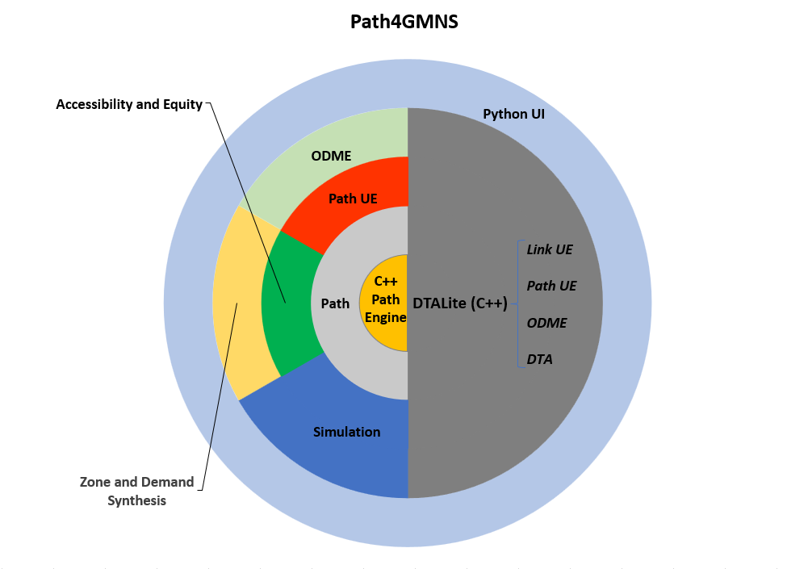

.. Path4GMNS documentation master file, created by
   sphinx-quickstart on Tue Oct  4 16:19:25 2022.
   You can adapt this file completely to your liking, but it should at least
   contain the root `toctree` directive.

Welcome to Path4GMNS's documentation!
=====================================

`Path4GMNS <https://github.com/jdlph/Path4GMNS>`_ is an open-source, cross-platform,
lightweight, and fast Python path engine for networks encoded in
`GMNS <https://github.com/zephyr-data-specs/GMNS>`_. Besides finding static
shortest paths for simple analyses, its main functionality is to provide an
efficient and flexible framework for column-based (path-based) modeling and
applications in transportation (e.g., activity-based demand modeling).
Path4GMNS supports, in short,

1. finding (static) shortest path between two nodes,
2. performing path-based User-Equilibrium (UE) traffic assignment,
3. conducting dynamic traffic assignment (DTA) after UE.
4. evaluating multimodal accessibility and equity,
5. synthesizing zones and Origin-Destination (OD) demand for a given network.

Path4GMNS also serves as an API to the C++-based
`DTALite <https://github.com/jdlph/DTALite>`_ to conduct various multimodal
traffic assignments including,

* Link-based UE,
* Path-based UE,
* UE + DTA,
* OD Matrix Estimation (ODME).

Quick Start
-----------

We highly recommend that you go through
`this tutorial <https://github.com/jdlph/Path4GMNS/blob/dev/tutorial/tutorial.ipynb>`_
written in Jupyter notebook with step-by-step demonstration using the latest
version, no matter you are one of the existing users or new to Path4GMNS.

Contents
========

.. toctree::
   :maxdepth: 2

   installation
   usecases
   implnotes
   api
   updates